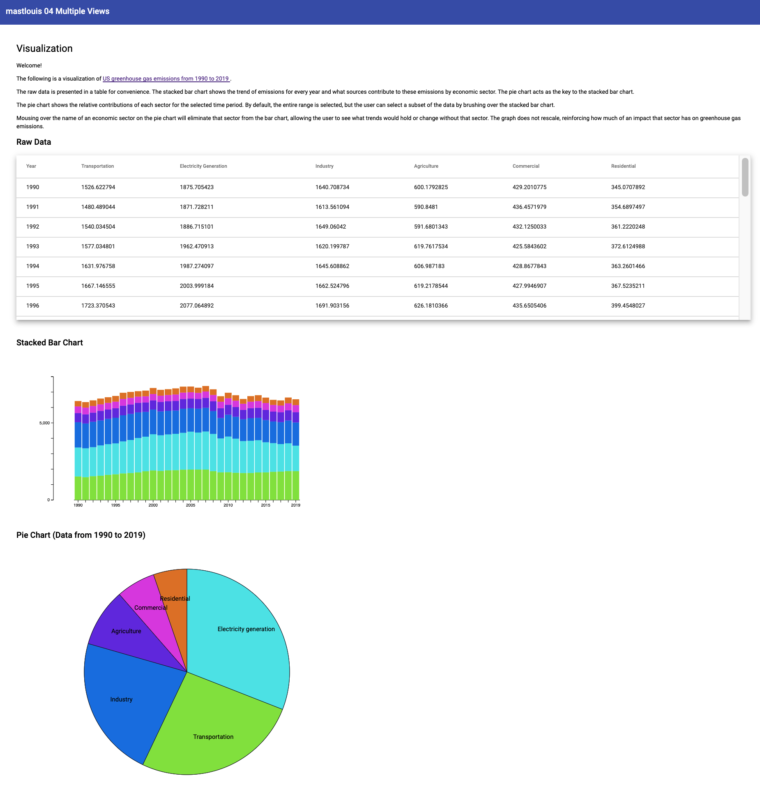

Assignment 4 - Visualizations and Multiple Views  
===

Matthew St Louis

Submission Link: https://mastlouis.github.io/04-multiple-views/

## Summary
The following is a visualization of [US greenhouse gas emissions from 1990 to 2019](https://cfpub.epa.gov/ghgdata/inventoryexplorer/index.html).

The raw data is presented in a table for convenience.
The stacked bar chart shows the trend of emissions for every year and what
sources contribute to these emissions by economic sector. The pie chart acts
as the key to the stacked bar chart.

The pie chart shows the relative
contributions of each sector for the selected time period. By default, the
entire range is selected, but the user can select a subset of the data by
brushing over the stacked bar chart.

Mousing over the name of an economic sector on the pie chart will eliminate
that sector from the bar chart, allowing the user to see what trends would
hold or change without that sector. The graph does not rescale, reinforcing
how much of an impact that sector has on greenhouse gas emissions.

As a note, the project is deployed on the ghpages branch using [`angular-cli-ghpages`](https://www.npmjs.com/package/angular-cli-ghpages). This was built from the main branch.

## Design Achievements
This project is built using [Angular](https://angular.io/). I wanted to see how hard it would be to integrate d3 with Angular and how much of a challenge it would be to write d3 in typescript. I was surprised how far you can get with the default `any` type, but there were many times I needed to work around having my code stored in an Angular component. I tried passing data between components, and I was successful, but I ended up moving everything to the same component when I couldn't get the [`ngOnChanges`](https://angular.io/api/core/OnChanges) lifecycle hook to fire properly.

## Design Achievements
I styled this project using [Angular Material](https://material.angular.io/). This is where the banner at the top and the styles for the table come from.

## References
I used the following references for the listed roles in completing this project.

- [Angular D3 Tutorial](https://blog.logrocket.com/data-visualization-angular-d3/): Learned how to integrate angular with d3; sample pie chart.
- [Data Source](https://cfpub.epa.gov/ghgdata/inventoryexplorer/index.html): This is where I got the greenhouse gas emissions data.
- [Bar Chart Tutorial](https://www.d3-graph-gallery.com/graph/barplot_stacked_basicWide.html): This was the reference I used to make a stacked bar plot.
- [Alt bar tutorial](https://observablehq.com/@d3/stacked-bar-chart): Supplementary stacked bar chart example.
- [How to brush a bar chart](http://codexe.net/d3/d3-brush-zoom-bar-chart.html)
- [How to clean ticks in d3](https://stackoverflow.com/questions/38921226/show-every-other-tick-label-on-d3-time-axis)
- [Map over JS object's keys and values](https://stackoverflow.com/questions/62445521/typescript-map-over-objects-keys-and-values)
- [Removing a property from an object in js](https://www.w3schools.com/howto/howto_js_remove_property_object.asp)
- [Charts that respond to dynamic data example](https://medium.com/swlh/reactive-charts-in-angular-8-using-d3-4550bb0b4255)
- [Angular Lifecycle hooks](https://www.freecodecamp.org/news/angular-lifecycle-hooks/)
- [Pie chart transitions](https://dzone.com/articles/silky-smooth-piechart-transitions-with-react-and-d)
  - [Supplemental pie chart transitions](https://www.d3-graph-gallery.com/graph/pie_changeData.html)

## Screenshot
